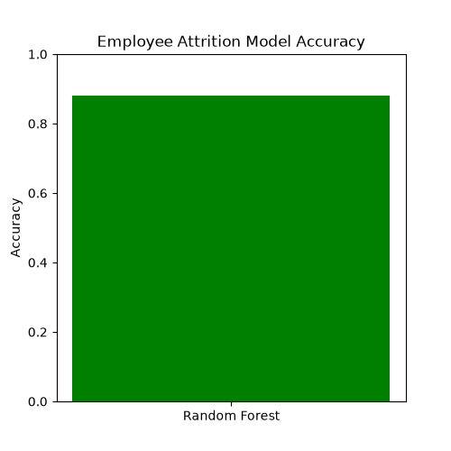
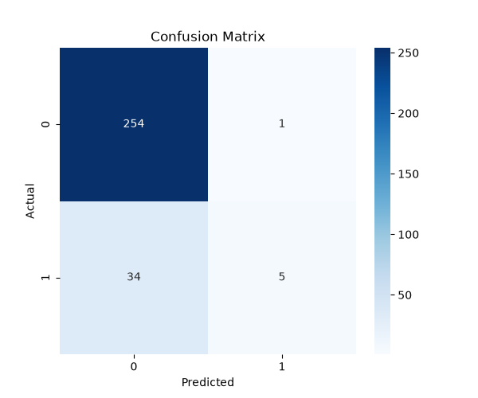
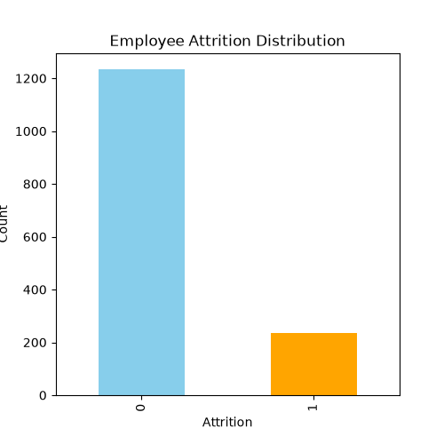
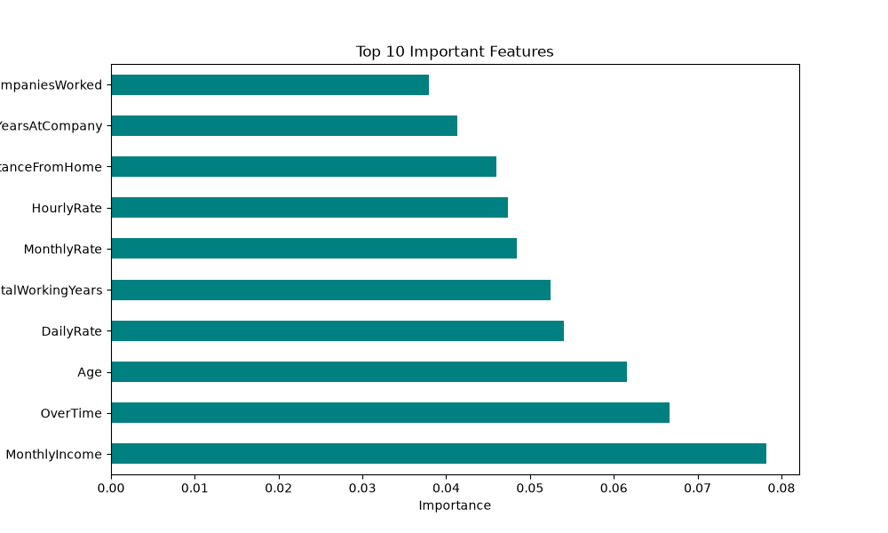

# Employee Attrition Analysis using Machine Learning

## 📌 Project Overview

This project predicts whether an employee is likely to leave the company (Attrition) using Machine Learning. The model is built using the Random Forest Classifier and trained on the IBM HR Analytics Employee Attrition dataset. The project includes data preprocessing, feature encoding, model training, evaluation, visualization, and prediction.

---

## 🚀 Features

- Data Cleaning & Preprocessing
- Label Encoding for Categorical Features
- Random Forest Classification Model
- Employee Attrition Prediction
- Model Evaluation
- Accuracy Score
- Classification Report
- Confusion Matrix
- Feature Importance Visualization

---

## 🛠 Technologies Used

- Python
- Pandas
- NumPy
- Matplotlib
- Seaborn
- Scikit-learn
- Joblib

---

## 📂 Project Structure

```text
Employee_Attrition_Analysis
│
├── attrition.py
├── predict.py
├── employee_attrition_model.pkl
├── label_encoder.pkl
├── IBM_HR_Analytics.csv
├── requirements.txt
├── README.md
│
├── accuracy.png
├── confusion_matrix.png
├── attrition_distribution.png
└── feature_importance.png

```

---

## 📊 Dataset

Dataset Used:

**IBM HR Analytics Employee Attrition & Performance Dataset**

Target Column:

**Attrition**

---

## 🤖 Machine Learning Model

- Random Forest Classifier

---

## 📈 Model Performance

- Accuracy: **87.41%**
- Classification Report
- Confusion Matrix

---

## ▶️ How to Run

### 1️⃣ Install Required Libraries

```bash
pip install -r requirements.txt
```

### 2️⃣ Train the Model

```bash
python attrition.py
```

### 3️⃣ Predict Employee Attrition

```bash
python predict.py
```

---

# 📷 Output

## Model Accuracy



---

## Confusion Matrix



---

## Employee Attrition Distribution



---

## Feature Importance



---

## Prediction Output

```
==================================================
      Employee Attrition Prediction
==================================================

Employee is NOT likely to leave the company.
```

or

```
==================================================
      Employee Attrition Prediction
==================================================

Employee is likely to LEAVE the company.
```

---

## 🎯 Project Workflow

- Load Dataset
- Data Cleaning
- Label Encoding
- Feature Selection
- Train-Test Split
- Random Forest Model Training
- Model Evaluation
- Prediction
- Data Visualization

---

## 📌 Future Improvements

- Deploy using Streamlit
- Build a Web Application
- Hyperparameter Tuning
- Try Multiple ML Algorithms
- Improve Prediction Accuracy

---

## 👨‍💻 Author

**Aman Gupta**

B.Tech Computer Science

3rd Year Student

Codec Technologies Internship Project
